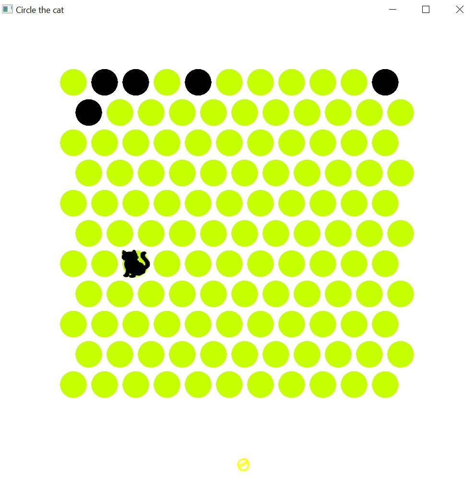

# Circle the Cat

Welcome to **Circle the Cat** - a fun and challenging game where you can test your strategic skills against a crafty feline opponent. In this README, we'll provide an overview of the game and its key components.

## Game Description

**Circle the Cat** is a turn-based game that pits the player against a computer-controlled cat. The game revolves around a graphical interface featuring a grid or board composed of tiles. At the beginning of each game, some tiles are already blocked, and one tile contains the cat (a blocked tile).

### Objective

**Player's Goal**: The player's objective is to block the cat's movement and prevent it from escaping the board. On each turn, the player must click on a free tile to block it, ultimately surrounding the cat.

**Computer's Goal**: The computer-controlled cat's objective is to outsmart the player by moving to adjacent and free tiles on each turn, with the final goal of escaping the board. The only way the cat can exit the board is through the threshold tiles.

## Key Data Structures

To implement the game, we use the following essential data structures:

1. **List of Neighbors (m_neighbors)**: This data structure is implemented as a `std::map<int, std::shared_ptr<Tile>>` and is used to keep track of adjacent tiles for each tile on the board. It is crucial for determining valid moves for the cat and player.

2. **List of Tiles (m_tiles)**: A `std::vector<std::shared_ptr<Tile>>` is used to represent all the tiles on the game board. It helps manage the state of each tile, whether it is blocked or free, and keeps track of the cat's location.

## Noteworthy Algorithms

One of the key algorithms in **Circle the Cat** is the search algorithm used by the computer to determine the cat's movement. This algorithm guides the cat to take steps in a "correct" route, leading it toward the threshold tiles and ultimately, freedom. This algorithm challenges the player's ability to predict and counter the cat's moves.

## Getting Started

To start playing **Circle the Cat**, follow these steps:

1. Clone this repository to your local machine.
2. Compile the source code using a C++ compiler.
3. Run the compiled executable.

